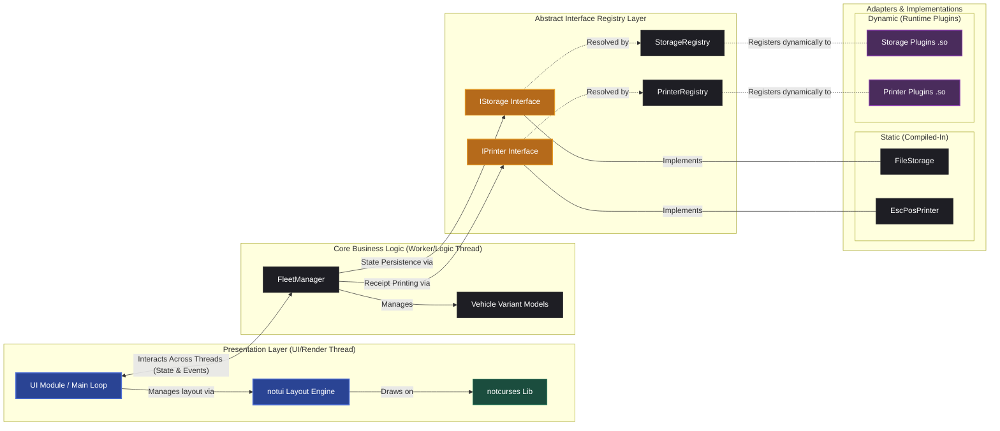

<p align="center">
  <a href="https://github.com/justkowal/VehicleManagementSystem/actions/workflows/ci.yml">
    
  </a>
  <a href="https://github.com/justkowal/VehicleManagementSystem/actions/workflows/stress.yml">
    
  </a>
  <a href="https://github.com/justkowal/VehicleManagementSystem/actions/workflows/release.yml">
    
  </a>
  
</p>

<p align="center">
  
  
  
  
  
  
</p>

<p align="center">
  
  
  
  
</p>

---

# Vehicle Management System

## Overview

The Vehicle Management System is a C++20 application designed with a focus on separation of concerns, thread safety, and modularity. Instead of standard console interfaces that bundle business logic with text output, this system uses `notui` - a custom terminal layout engine built on top of the `notcurses` library.

This design decouples core fleet management logic from terminal I/O, improving testability and facilitating future interface extensions.

## System Architecture



## Key Architectural Features

### Declarative UI (notui)
Uses a tree of UI components layout-managed via `VBox`, `HBox`, and `SplitBox` to automatically handle terminal resizing. User inputs (keyboard and mouse) are handled by a `FocusManager` that dispatches events down the active widget tree.

### Exception Safety & Transactional State
Ensures data integrity via strong exception guarantees. Mutating operations are performed on local memory copies and successfully persisted to disk before committing to active memory, rolling back cleanly upon failure.

### Concurrency Model
Maintains a responsive UI by using a readers-writer lock (`std::shared_mutex`). UI rendering threads read fleet data concurrently, while mutations are blocked and queued to ensure thread safety without unnecessary bottlenecks.

### Dynamic Plugin System
Supports runtime extensibility using a Service Locator pattern. The system scans designated folders to dynamically load and register dynamic storage or printing implementations (`.so` targets) without needing to rebuild the core application.

## Build & CI/CD

- **CMake Presets** - Native CMake Workflow Presets provide standard configuration, build, and installation tasks.
- **Reproducible Environments** - Includes a `flake.nix` (Nix Flake) pinning the required C++ toolchain, libraries (e.g., `notcurses`) and development utilities (e.g. `escpresso`, `kitty`).
- **GitHub Actions** - CI workflows run builds, static analysis (Clang-Tidy), formatting checks (Clang-Format), thread stress tests, and automate CD release packaging.
- **Distribution Packages** - Integrated CPack configuration packages the compiled application into DEB, RPM, or TGZ formats.

## Getting Started

### 0. Nix Development Environment (Recommended)
To run within the pinned dev shell containing the complete C++20 toolchain (GCC, CMake, `notcurses`, `clang-tools`, and GPU-dependent utilities like `escpresso` or `kitty`):
```bash
nix develop --impure
```
*Note: The `--impure` flag is required because of GPU bridging/nixGL runtime detection. The included `escpresso` utility can be used to view and verify ESC/POS printer output.*

### 1. Build and Install the App
To configure, build, and install the application using standard CMake presets:
```bash
cmake --workflow --preset install-app
```

### 2. Build and Install Plugins (Optional)
To build and install the dynamic library plugins:
```bash
cmake --workflow --preset install-plugin
```

### 3. Run Tests
To run unit tests (including concurrency checks):
```bash
./build/bin/UnitTests
```
